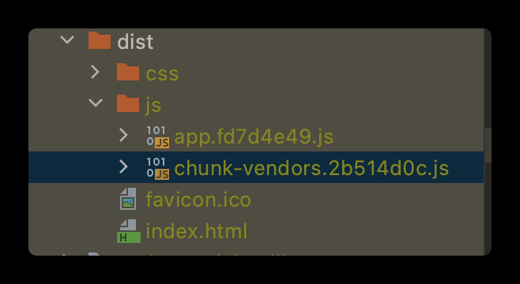
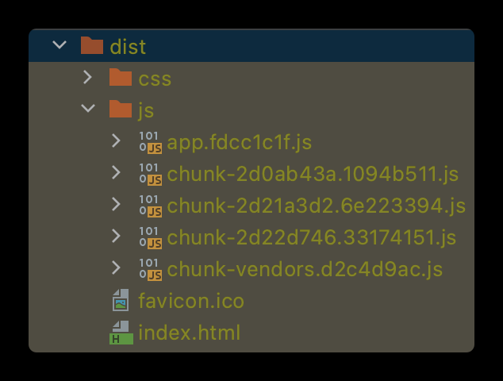
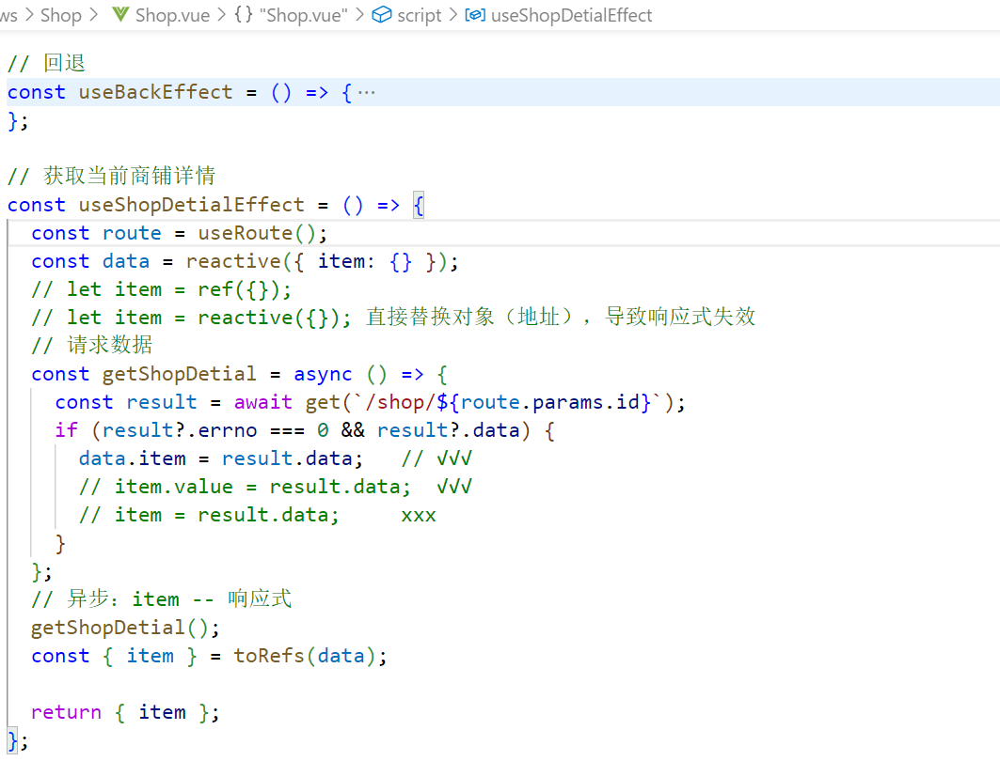
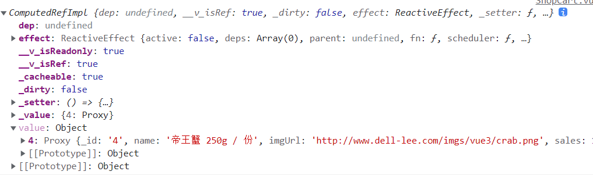

# JD_lqs

## vuex\router

## 自定义Hook函数：

把setup函数中使用Copmosition API进行封装，让功能相关的代码有序的组织在一起，使setup中的逻辑（流程）更清晰易懂

## 路由懒加载：

    打包构建应用时，js包会变得非常大，影响页面加载

    将路由对应的组件打包成一个个js代码块，在路由被访问时才加载对应组件，更加高效

组件合理拆分、localStorage验证登录、Fastmock模拟后台

响应式数据替换对象：

## 计算属性return的数据直接使用，vue内部解析，

computedRefImpl:  使用某个计算属性需要  computed.value

## vue2 生命周期--流程

## vue3 setup（） -- 数据驱动

token可返回，有效期超过重新验证

改一下session.userInfo
